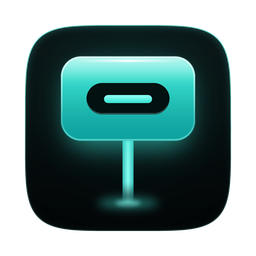

<p align="center">
  
</p>

<h1 align="center">Bus Stop</h1>

<p align="center"><strong>A live map of every port on your Mac.</strong></p>

Bus Stop is a free, open-source menu bar app for macOS. It was designed for macOS 27 and also runs on macOS 26. It shows every physical port on your Mac (USB-C and Thunderbolt, MagSafe, USB-A, HDMI), what is plugged into each one, how fast each link runs and how much power flows through it. Hubs, docks and daisy-chained Thunderbolt devices appear as trees, and every device is labelled with the port it hangs off. Everything stays on your Mac: Bus Stop has no network code and no telemetry.

## Features

- **Port map in the menu bar.** One card per physical port in physical order, with what is connected, the active transports and the power in or out. Optional live text next to the icon: total watts, device count, or both.
- **Link speeds** for every device and port, such as "USB 3.2 Gen 2 @ 10 Gb/s" or "USB4 v2 / TB5 @ 80 Gb/s".
- **Hubs, docks and daisy chains.** USB hub trees and Thunderbolt / USB4 chains, with device counts and power rolled up to each hub and to the Mac.
- **Power.** Watts in and out per port, a charger card with the active USB-PD contract ("20 V × 4.7 A") and every profile the charger offers, battery state, and a sparkline of the last few minutes.
- **Real port names.** "Left Front · USB-C" instead of "Port 2", from a per-model catalogue. You can rename any port.
- **Instant change detection.** Plug and unplug events show up at once, with an event timeline and optional notifications for connections, disconnections and link downgrades.
- **Topology window.** A graph of host, ports and devices with links drawn by speed, sortable port and device tables, power charts, the event log, diagnostics and an inspector with the raw IORegistry keys.
- **Diagnostics in plain English.** A USB 3 device stuck at USB 2 speed, a Thunderbolt link slowed by its cable, a charger too weak for the Mac, a battery not charging, a bus-powered hub over its power budget, a very deep chain, liquid detected in a port.
- **Cable details** when the port reports them: active or passive, optical.
- **Export** a JSON snapshot, a Markdown report or a raw IORegistry capture for bug reports. Serial numbers are redacted by default.
- **Demo mode** with realistic sample setups, for trying Bus Stop on a Mac with nothing plugged in.
- **Command-line tool** `busstop` with text, JSON, Markdown and raw output, a watch mode and the demo scenarios.
- **Settings** for text size, background opacity, menu bar content, notifications and launch at login.

## Screenshots


*The popover, here with the Studio desk demo setup: the charger and its USB-PD contract, a diagnostic, and one card per port with the devices behind it, their link speeds and power.*


*The topology window: the Mac, its ports and every device behind them as a graph, with each link drawn by speed. The sidebar leads to the port and device tables, power, events and diagnostics.*

CI captures these images from the real app, running in demo mode on macOS 27, on every push to the main branches, so they show the current build. The [`screenshots` branch](https://github.com/static74/BusStop/tree/screenshots) has the other demo setups and every settings pane.

## Requirements

- macOS 26 Tahoe or later. Bus Stop was designed for macOS 27 Golden Gate and also runs on macOS 26 Tahoe; CI builds and tests it on both.
- Apple silicon recommended. Bus Stop runs on Intel Macs with macOS 26, but their port controllers do not publish the per-port detail it reads, so the map is less complete there.

## Install

### From a release

1. Download `BusStop.zip` from the [latest release](https://github.com/static74/BusStop/releases/latest).
2. Open the zip and move **Bus Stop** to your Applications folder. The zip also holds `LICENSE.txt` and `THIRD_PARTY_NOTICES.md`; the app carries its own copies, so you can leave them behind.
3. Open Bus Stop. Release builds are signed ad hoc and not notarized, so the first time macOS says it cannot check the app. Click **Done**, open **System Settings › Privacy & Security**, scroll down to the message about Bus Stop and click **Open Anyway**. Confirm with your password or Touch ID. You only need to do this once.

Each release also lists the SHA-256 checksum of the zip. To check it, download `BusStop.zip.sha256` next to the zip and run `shasum -a 256 -c BusStop.zip.sha256`.

Bus Stop lives in the menu bar and has no Dock icon. Left-click the icon for the port map; right-click it for the menu.

### Build from source

You need Xcode 27 (or Xcode 26.6) and its command-line tools. There is no Xcode project; the app is a Swift package plus a bundling script.

```sh
git clone https://github.com/static74/BusStop.git
cd BusStop
scripts/install.sh              # build, copy to /Applications and open
scripts/install.sh --link-cli   # the same, plus a busstop command on your PATH
```

`install.sh` builds for your Mac's architecture and copies the app to `/Applications`, or to `~/Applications` when `/Applications` is not writable. A build made on your own Mac carries no quarantine attribute, so it opens without the "Open Anyway" step.

To build without installing:

```sh
swift build                     # debug build of everything
swift test                      # unit tests
scripts/build-app.sh            # build/Bus Stop.app and build/BusStop.zip
ARCHS=universal scripts/build-app.sh   # arm64 and x86_64 in one bundle
```

## Command-line tool

The app bundle contains the `busstop` command at `Bus Stop.app/Contents/Helpers/busstop`. `scripts/install.sh --link-cli` links it to `/usr/local/bin/busstop`, or to `~/.local/bin/busstop` when `/usr/local/bin` is missing or not writable.

```
busstop                         # human-readable tree
busstop --json                  # the snapshot as JSON
busstop --markdown              # a Markdown report
busstop --raw                   # raw IORegistry capture as JSON, for bug reports
busstop --watch                 # print connection changes as they happen (Control-C to stop)
busstop --watch --json          # the same, one JSON object per line
busstop --demo studioDesk       # any of the above against a demo setup
busstop --input capture.json    # any of the above against a saved raw capture
busstop --version
busstop --help
```

Demo setups are `studioDesk`, `travel`, `dockStation` and `unplugged`; with `--watch`, every setup except `unplugged` (which has nothing plugged in) unplugs and replugs a sample device every few seconds. Serial numbers are redacted from JSON, Markdown, raw and watch output unless you add `--no-redact`, and `--no-smc` skips the SMC power readings. Device names are stripped of control characters before they reach the terminal. The tool exits with status 0 on success, 1 on a runtime error and 2 on a usage error, and writes errors to standard error.

The default output looks like this:

```
MacBook Pro (14-inch, 2026, M5 Pro) · macOS 27.0
Power: 96W USB-C Power Adapter · 20 V × 4.7 A · 61 W in · Charging · 82% · 4.5 W to ports
├─ Left Rear · MagSafe   96W USB-C Power Adapter   ↓ 61 W
├─ Left Front · USB-C   USB 3.2 Gen 2 @ 10 Gb/s   ↑ 4.5 W
│  └─ Samsung T9 · 10 Gb/s · 4.5 W
└─ Right Center · USB-C   (empty)
```

## Privacy

- No network code, no analytics, no crash reporting, no accounts. The app does not ask for network access.
- Bus Stop only reads: IORegistry properties, the power-source API and the SMC's read-only power keys. It never ejects, powers off or reconfigures anything.
- Settings and port names are stored in the app's preferences. The event log and power history stay in memory. Nothing is written anywhere else unless you export.
- Exports and `busstop --watch` redact serial numbers and the computer name by default.

## How it works

Bus Stop reads the Mac's port controllers, USB and Thunderbolt device trees, power telemetry and displays from IOKit into a plain, platform-neutral snapshot of raw registry properties. A pure Swift topology builder turns that snapshot into ports, device trees, link speeds and power figures, a diagnostics engine adds findings, and a differ compares consecutive snapshots to produce connection events. IOKit notifications trigger a new capture within a quarter of a second of any change. Because the raw snapshot is plain data, the same pipeline runs on demo data, on saved captures and in tests on Linux. [docs/ARCHITECTURE.md](docs/ARCHITECTURE.md) explains the modules, the data flow and the threading model, and [docs/SPEC.md](docs/SPEC.md) is the full specification.

## Contributing

Bug reports with a raw capture (`busstop --raw > capture.json`) are the most useful thing you can send. See [CONTRIBUTING.md](CONTRIBUTING.md) for how to build, test, add a Mac model to the port catalogue and turn a capture into a test fixture.

## Credits

- **[PortScope](https://github.com/azenla/portscope)** by Alex Zenla (MIT): the per-model catalogue of physical port locations.
- **[WhatPort](https://github.com/darrylmorley/whatport)** and **[WhatCable](https://github.com/darrylmorley/whatcable)** by Darryl Morley (MIT): research on Apple's port controllers, SMC power channels and Thunderbolt chain attribution. Files that adapt their code say so at the top.
- The Linux kernel's Thunderbolt driver ([`drivers/thunderbolt/tb_regs.h`](https://github.com/torvalds/linux/blob/master/drivers/thunderbolt/tb_regs.h)) documents the link speed codes Bus Stop decodes. No kernel code is used.

Full licence texts are in [THIRD_PARTY_NOTICES.md](THIRD_PARTY_NOTICES.md), which every build also carries in `Bus Stop.app/Contents/Resources`.

Bus Stop was inspired by [ViewPorts](https://viewports.app/), a commercial menu bar app that maps a Mac's ports, devices and power. Bus Stop is an independent project written from public information; it shares no code or assets with ViewPorts and is not affiliated with its developer.

## Licence

Bus Stop is released under the [MIT License](LICENSE).

Apple, Mac, macOS, MagSafe and Xcode are trademarks of Apple Inc. Thunderbolt is a trademark of Intel Corporation. USB-C and USB4 are trademarks of the USB Implementers Forum. HDMI is a trademark of HDMI Licensing Administrator, Inc. Bus Stop is not affiliated with or endorsed by any of them.
